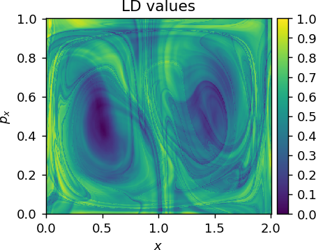

<!-- #region -->
**LDDS**: Python package for Computation of Lagrangian Descriptors of Dynamical Systems.

## Table of contents
* [Description](#description)
* [Dependencies and installation](#dependencies-and-installation)
	* [Installing from source](#installing-from-source)
    * [Testing](#testing)
* [Documentation](#documentation)
* [Examples and Tutorials](#examples-and-tutorials)
* [How to cite](#how-to-cite)
* [Authors and contributors](#authors-and-contributors)
* [Contributing](#contributing)
* [License](#license)
* [Acknowledgements](#acknowledgements)


LDDS
====

[](https://joss.theoj.org/papers/708c2c717f803733ce017abb10f06030)

[](https://github.com/champsproject/ldds/actions/workflows/draft-pdf.yml)

[](https://ldds.readthedocs.io/en/latest/?badge=latest)

[](https://mybinder.org/v2/gh/champsproject/ldds/HEAD) 
<!-- #endregion -->

## Description

**LDDS** is an open-source Python module that uses the method of **Lagrangian Descriptors** (LDs) for visualization of phase space structures of dynamical systems.

First introduced by Madrid & Mancho (Chaos 2009), the method of LDs defines a function, called the Lagrangian descriptor function, defined as a scalar field that maps a set of initial condition in phase space to the "arc length" integral of their evolving trajectories in time. This approach is capable of highlighting the phase space geometry of invariant manifolds associated with periodic orbits and equilibria of dynamical systems. Over the years new formulations of the method have been developed for enhanced visualization of phase space structures. See our [online book](https://champsproject.github.io/lagrangian_descriptors) for an overview on the topic. 

In LDDS we implemented the majority of the LD variants and users can be able to work with dynamical systems with continuous flows and discrete maps in deterministic and stochastic settings, with high-dimensional vector fields described as analytical expressions or numerical data. See the [**Examples and Tutorials**](#examples) section below to have an idea of the versatility of this package.

Nonlinear dynamical systems are ubiquitous in natural and engineering sciences, such as fluid mechanics, theoretical chemistry, ship dynamics, rigid body dynamics, atomic physics, solid mechanics, condensed matter physics, mathematical biology, oceanography, meteorology and celestial mechanics [@wiggins1994normally and references therein]. We expect our package to enable researchers in these and other areas to take advantage of the LDs methods in research.


## Dependencies and installation

The `setup.py` should install the dependencies listed in
[requirements.txt](https://github.com/champsproject/ldds/blob/develop/requirements.txt) using

``` bash
pip install -r requirements.txt (or pip3 install -r requirements.txt)
```


### Installing from source
Clone the git repository and install `ldds` as a module using

``` bash
git clone git@github.com:champsproject/ldds.git
cd ldds
python setup.py install
```

<!-- #region -->
### Testing 

Test your installation with following command:

```bash
python -m unittest
```

You should see something like the following on the terminal:

```bash
Ran 1 test in 11.173s

OK
```
<!-- #endregion -->

<!-- #region -->
## Documentation

**LDDS** uses [Sphinx](http://www.sphinx-doc.org/en/stable/) for documentation and is made available online [here](https://ldds.readthedocs.io/en/latest/?badge=latest#). To build the html version of the docs locally simply:

```bash
cd docs
make html
```

The generated html can be viewed by opening `docs/_build/html/index.html`.
<!-- #endregion -->

<!-- #region -->
## Examples and Tutorials 

You can find useful tutorials on how to use LDDS in the [tutorials](tutorials/README.md) folder.

Here we show two examples of the output contour maps produced with `ldds` for the Lagrangian Descriptor values of a deterministic ([Tutorial 2](tutorials/tutorial-2.ipynb)) and a stochastic ([Tutorial 10](tutorials/tutorial-10.ipynb)) benchmark system:

<p style="text-align:center">

<em>Duffing oscillator with harmonic forcing.</em>
</p>


<p style="text-align:center">

<em>Double-gyre with stochastic forcing.</em>
</p>
<!-- #endregion -->

## How to cite

_NOTE 19 May 2020_ : We have recently submitted LDDS to [JOSS](https://joss.theoj.org/) and now awaiting revision. 

If you use this package in your publications, provisionally you can cite the package as follows:

> LDDS: Python package for Computation of Lagrangian Descriptors of Dynamical Systems. https://github.com/champsproject/ldds 

Or if you use LaTeX:

```tex
@misc{LDDS,
  author = {B. Aguilar-Sanjuan and V. Garc{\'i}a-Garrido and V. Kraj\v{n}{\'a}k and S. Naik and S. Wiggins},
  title = {{LDDS}: {P}ython package for computing and visualizing {L}agrangian {D}escriptors in {D}ynamical {S}ystems.},
  howpublished = {\url{https://github.com/champsproject/ldds}}
}
```

<!-- #region -->
## Authors and contributors

**LDDS** is currently developed and mantained by 

* [Broncio Aguilar-Sanjuan](mailto:broncio.aguilarsanjuan@bristol.ac.uk) _University of Bristol_ , UK
* [Víctor J. García-Garrido](mailto:vjose.garcia@uah.es) _Universidad de Alcalá_ , Spain
* [Vladimír Krajňák](mailto:v.krajnak@bristol.ac.uk) _University of Bristol_ , UK
* [Shibabrat Naik](mailto:s.naik@bristol.ac.uk) _University of Bristol_ , UK


with the support of and supervision of [Prof. Stephen Wiggins](mailto:s.wiggins@bristol.ac.uk) (_University of Bristol_ , UK), under the [CHAMPS Project](https://champsproject.com/).

Contact us by email for further information or questions about **LDDS**, or suggest pull requests. Contributions improving either the code or the documentation are welcome!
<!-- #endregion -->

## Contributing 

Guidelines on how to contribute to this package can be found [here](https://github.com/champsproject/ldds/blob/develop/contributing.md) along with the code of conduct [here](https://github.com/champsproject/ldds/blob/develop/code_of_conduct.md) for engaging with the fellow contributors. As and when we receive improvements to the package, we will acknowledge the pull request and the contributor in this section.


## License

See the [LICENSE](LICENSE) file for license rights and limitations.


## Acknowledgements

We acknowledge the support of EPSRC Grant No. EP/P021123/1 [CHAMPS project](https://champsproject.com). 
