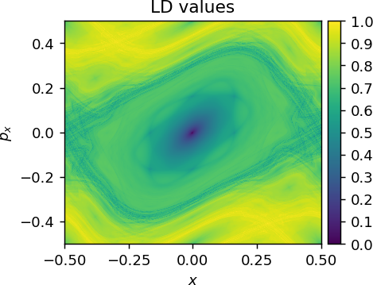
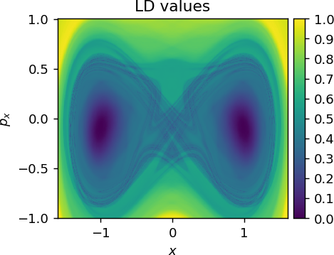
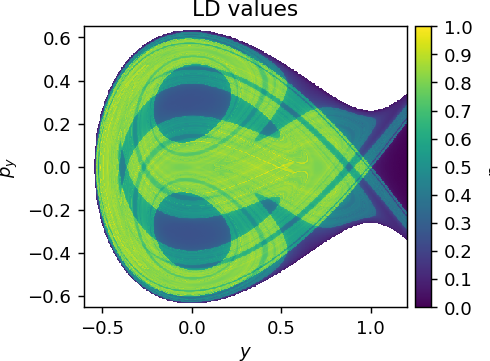

## Statement of Need

Nonlinear dynamical systems are ubiquitous in natural and engineering sciences, such as, fluid mechanics, theoretical chemistry, ship dynamics, rigid body dynamics, atomic physics, solid mechanics, condensed matter physics, mathematical biology, oceanography, meteorology and celestial mechanics [@wiggins1994normally and references therein]. There have been many advances in understanding phenomena across these disciplines using the geometric viewpoint of the solutions and the underlying structures in the phase space. Chief among these phase space structures are the invariant manifolds that form a barrier between dynamically distinct solutions [@OzoriodeAlmeida1990], [@RomKedar90], [@wiggins_role_2016]. In most nonlinear systems, the invariant manifolds are computed using numerical techniques that rely on some form of linearization around equilibrium points followed by continuation and globalization. However, these methods become computationally expensive and challenging when applied to the high-dimensional phase space of vector fields defined analytically, from numerical simulations or experimental data. This points to the need for techniques that can be paired with trajectory calculations, without excessive computational overhead and at the same time can allow visualization along with trajectory data. The Python package, `LDDS`, serves this need for analyzing deterministic and stochastic, continuous and discrete high-dimensional nonlinear dynamical systems described either by an analytical vector field or from data obtained from numerical simulations or experiments.

To the best of our knowledge, no other software for calculating Lagrangian descriptors exists. A variety of computational tools is available for competing approaches popular in fluid mechanics, such as the identification of Lagrangian coherent structures via finite-time Lyapunov exponents [@lagrangian], [@dgftle], [@lcstool], [@libcfd2lcs], [@lcsmatlabkit], [@activeBarriers] and finite-size Lyapunov exponents [@lagrangian] or Eulerian coherent structures [@barriertool].

## Summary and Functionalities

The `LDDS` software is a Python-based module that provides the user with the capability of analyzing the phase space structures of both continuous and discrete nonlinear dynamical systems in the deterministic and stochastic settings through the method of Lagrangian descriptors (LDs) [@madrid2009ld], [@mancho_2013]. The main idea behind this methodology is to define a scalar function, a Lagrangian descriptor, that accumulates the values taken by a positive function of the phase space variables of the system along the trajectory starting from a given initial condition. This operation is carried out in forward and backward time for all initial conditions on a predefined grid, and the output obtained from the method provides an indicator of the underlying geometry of the phase space of the dynamical system under study. One of the main goals we pursue with this software is to give the tools for reproducible scientific research.

Given a continuous-time dynamical system:

\begin{equation}
\dfrac{d \mathbf{x}}{dt} = \mathbf{f}\left(\mathbf{x}(t),t\right)
\end{equation}

where $\mathbf{x} \in \mathbb{R}^{n}$ and $\mathbf{f}$ represents the vector field. To compute Lagrangian descriptors, select any initial condition $\mathbf{x}_0 = \mathbf{x}(t_0)$ at time $t = t_0$ and accumulate a positive function of the phase space variables along its trajectory in forward and backward in time in the interval $[t_0-\tau,t_0+\tau]$. This gives the following definition:

\begin{equation}
\mathcal{L}\left(\mathbf{x}_0,t_0,\tau\right) = \int_{t_0-\tau}^{t_0+\tau} g(\mathbf{x}(t);\mathbf{x}_0) \, dt
\end{equation}

Different versions of the Lagrangian descriptor exist in the literature where the adopted positive function $g$ varies. These alternative definitions include the use of trajectory arclength, the p-norm of the vector field of the dynamical system, the Maupertuis' action of Hamiltonian mechanics, etc. The approach provided by Lagrangian descriptors for revealing phase space structure has also been adapted to address discrete-time systems (maps) and stochastic systems.

This open-source package incorporates the following features:

* Computation of LDs for two-dimensional maps.
* Study of the phase space structure of two-dimensional continuous dynamical systems with LDs.
* Computation of LDs for a system of two stochastic differential equations with additive noise.
* Computation of LDs on two-dimensional phase space planes for Hamiltonian systems with 2 or more degrees of freedom (DoF).
* Application of LDs to Hamiltonian systems with 2 DoF where the potential energy surface is known on a discrete spatial grid.
* Computation of LDs from a Spatio-temporal discretization of a two-dimensional time-dependent vector field.
* Visual extraction of the invariant stable and unstable manifolds from the LD scalar field values.
* Addition to time-dependent external forcings for two-dimensional continuous dynamical systems.
* Different definitions for the Lagrangian descriptor function found in the literature.

All the different features of the module, and their usage across different settings, are illustrated through Jupyter-notebook tutorials. These tutorials would help users better understand how to set up a model dynamical system to which LDs is applied, and present them with different options for visualizing the results obtained from the analysis. We believe that these resources provide useful material for the development of an effective learning process that could motivate the integration of this tool into users' research/academic projects. Moreover, this will surely encourage future contributions from the scientific community to extend the features and applicability of this software package to other areas. 

### Example systems {#examples}

The following dynamical systems are included in this software package as examples to illustrate the application of Lagrangian descriptors:

#### Maps:

* Standard map 

The standard map (kicked rotator) is a two-dimensional map used in dynamical systems to study a periodically 
kicked pendulum. The equations of the discrete system are given by the expressions:
\begin{equation}
\begin{cases}
x_{n+1} = x_{n} + y_{n} - \dfrac{K}{2\pi} \sin(2\pi x_{n}) \\[.2cm]
y_{n+1} = y_{n} - \dfrac{K}{2\pi} \sin(2\pi x_{n})
\end{cases}
\end{equation}
where $K$ is the parameter that controls the forcing strength of the perturbation. The inverse map is described by:
\begin{equation}
\begin{cases}
    x_{n} = x_{n+1} - y_{n+1} \\[.2cm]
    y_{n} = y_{n+1} + \dfrac{K}{2\pi} \sin(2\pi (x_{n+1} - y_{n+1}))
\end{cases}
\end{equation}

In the following figure, we show the output produced by the LDDS software package for the standard map using the model parameter value $K=1.2$.

#### Flows:

Two-dimensional phase space:

* Forced undamped Duffing oscillator (Forced/Unforced).

The time-dependent Hamiltonian that describes the forced Doffing oscillator is:

\begin{equation}
 H(x,p_x,t) = \dfrac{1}{2}p_x^2 - \dfrac{\alpha}{2}x^2 + \dfrac{\beta}{4}x^4 - f(t) x
\end{equation}

where $\alpha$ and $\beta$ are the model parameters and $f(t)$ is the time-dependent focing added to the system. The non-autonomous vector field that defines the dynamical system is given by:

\begin{equation}
\begin{cases}
   \dot{x} = \dfrac{\partial H}{\partial p_x} = f_1(x,p_x) = p_x \\[.2cm]
   \dot{p}_x = -\dfrac{\partial H}{\partial x} = f_2(x,p_x) = \alpha x - \beta x^3 + f(t)
\end{cases}
\end{equation}

In the following figure we show the output produced by the LDDS software package for the forced Duffing oscillator using the model parameter value $\alpha = \beta = 1$. The initial time is $t_0 = 0$ and the perturbation used is of the form $f(t) = A\sin(\omega t)$ where $A = 0.25$ and $\omega = \pi$.

* Double-gyre flow with stochastic forcing.

The stochastic dynamical system for the double gyre flow with additive noise is described by the following stochastic differential equation:

\begin{equation}
\begin{cases}
   d X_t = \left(-\pi A \sin\left(\dfrac{\pi f(X_t,t)}{s}\right)\cos\left(\dfrac{\pi Y_t}{s}\right) - \mu X_t\right) \, dt + \sigma_1 \, dW_t^1 \\[.2cm]
   d Y_t = \left(\pi A \cos\left(\dfrac{\pi f(X_t,t)}{s}\right)\sin\left(\dfrac{\pi Y_t}{s}\right)\dfrac{\partial f}{\partial x}\left(X_t,t\right) - \mu Y_t\right) \, dt + \sigma_2  \, dW_t^2
\end{cases}
\end{equation}

where $W^1$ and $W^2$ are Wiener processes and we have that:

\begin{equation}
f(X_t,t) = \varepsilon \sin(\omega t + \phi) X_t^2 + \left(1-2\varepsilon\sin(\omega t + \phi)\right)X_t
\end{equation}

In the following figure we show the output produced by the LDDS software package for the stochastically forced double gyre using a noise amplitude of $\sigma_1 = \sigma_2 = 0.1$. The double gyre model parameters are $A = 0.25$, $\phi = 2\pi$, $\psi = \mu = 0$, $s = 1$, $\varepsilon = 0.25$, and the initial time is $t_0 = 0$.

Four-dimensional phase space:

* Saddle-center Hamiltonian.
* Hénon-Heiles Hamiltonian.

The Hénon-Heiles Hamiltonian is given by the functon:
\begin{equation}
H(x, y, p_x, p_y) = \frac{1}{2} (p_x^2 + p_y^2) + x^2 y - \frac{1}{3} y^3
\end{equation}
where the vector field is:
\begin{equation}
\begin{aligned}
 \dot{x} = & \dfrac{\partial H}{\partial p_x} =  p_x \\
 \dot{y} = & \dfrac{\partial H}{\partial p_y} = p_y  \\
 \dot{p}_x = & -\dfrac{\partial H}{\partial x} =  -x - 2 x y \\
 \dot{p}_y = & -\dfrac{\partial H}{\partial y} =  -x^2 -y + y^2
\end{aligned}
\end{equation}

IN the next figure we show the computation of Lagrangian descriptors with the LDDS software package on the phase space slice described by the condition $x = 0$, $p_x > 0$ for the energy of the system $H_0 = 1/5$.

## Relation to ongoing research projects

Lagrangian descriptors form the basis of several past and present research projects [@alvaro1], [@alvaro2], [@carlos2015], [@craven2015lagrangian], [@craven2016deconstructing], [@gg2016], [@balibrea2016lagrangian], [@demian2017], [@craven2017lagrangian], [@feldmaier2017obtaining], [@junginger2017chemical], [@gg2018], [@patra2018detecting], [@naik2019a], [@naik2019b], [@curbelo2019a], [@curbelo2019b], [@revuelta2019unveiling], [@GG2020a], [@GG2020b], [@krajnak2020manifld], [@naik2020], [@gonzalez2020], [@katsanikas2020a]. The common theme of all these projects is the investigation of phase space structures that govern phase space transport in nonlinear dynamical systems. We have also co-authored an open-source book project using Jupyter book [@jupyterbook_2020] on the theory and applications of Lagrangian descriptors [@ldbook2020]. This open-source package is the computational companion to that book.

## Acknowledgements

We acknowledge the support of EPSRC Grant No. EP/P021123/1 and Office of Naval Research (Grant No. N00014-01-1-0769). 

## References

